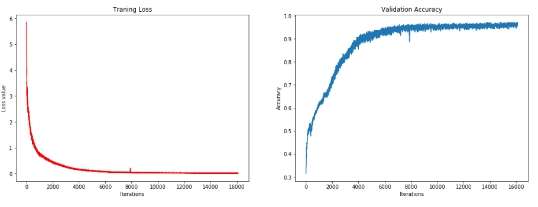

# Language Translation

A sequence to sequence model on a dataset of English and French sentences that can translate new sentences from English to French using Tensorflow.

The dataset is provided for easy reproduction. Although small, the dataset used in this notebook serves as a reasonable sanity test for the network which emphasizes the key data processing steps for this types of models to be trained successfully.

Bellow, one can see the model's loss and accuracy curves during training which emphasizes good generalization on this dataset.

*This notebook is part of my work on the Deep Learning Nanodegree from Udacity.*
