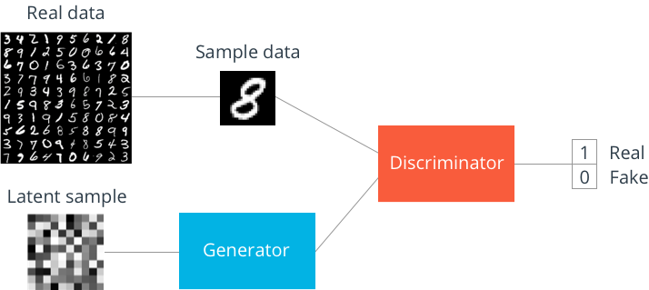

# Generative Adversarial Network

In this notebook, we'll be building a generative adversarial network (GAN) trained on the MNIST dataset. From this, we'll be able to generate new handwritten digits!

GANs were [first reported on](https://arxiv.org/abs/1406.2661) in 2014 from Ian Goodfellow and others in Yoshua Bengio's lab. Since then, GANs have exploded in popularity. Here are a few examples to check out:

* [Pix2Pix](https://affinelayer.com/pixsrv/) 
* [CycleGAN](https://github.com/junyanz/CycleGAN)
* [A whole list](https://github.com/wiseodd/generative-models)

The idea behind GANs is that you have two networks, a generator $G$ and a discriminator $D$, competing against each other. The generator makes fake data to pass to the discriminator. The discriminator also sees real data and predicts if the data it's received is real or fake. The generator is trained to fool the discriminator, it wants to output data that looks _as close as possible_ to real data. And the discriminator is trained to figure out which data is real and which is fake. What ends up happening is that the generator learns to make data that is indistiguishable from real data to the discriminator.



The general structure of a GAN is shown in the diagram above, using MNIST images as data. The latent sample is a random vector the generator uses to contruct it's fake images. As the generator learns through training, it figures out how to map these random vectors to recognizable images that can fool the discriminator.

The output of the discriminator is a sigmoid function, where 0 indicates a fake image and 1 indicates an real image. If you're interested only in generating new images, you can throw out the discriminator after training. Now, let's see how we build this thing in TensorFlow.


```python
%matplotlib inline

import pickle as pkl
import numpy as np
import tensorflow as tf
import matplotlib.pyplot as plt
```


```python
from tensorflow.examples.tutorials.mnist import input_data
mnist = input_data.read_data_sets('MNIST_data')
```

    Successfully downloaded train-images-idx3-ubyte.gz 9912422 bytes.
    Extracting MNIST_data/train-images-idx3-ubyte.gz
    Successfully downloaded train-labels-idx1-ubyte.gz 28881 bytes.
    Extracting MNIST_data/train-labels-idx1-ubyte.gz
    Successfully downloaded t10k-images-idx3-ubyte.gz 1648877 bytes.
    Extracting MNIST_data/t10k-images-idx3-ubyte.gz
    Successfully downloaded t10k-labels-idx1-ubyte.gz 4542 bytes.
    Extracting MNIST_data/t10k-labels-idx1-ubyte.gz


## Model Inputs

First we need to create the inputs for our graph. We need two inputs, one for the discriminator and one for the generator. Here we'll call the discriminator input `inputs_real` and the generator input `inputs_z`. We'll assign them the appropriate sizes for each of the networks.

>**Exercise:** Finish the `model_inputs` function below. Create the placeholders for `inputs_real` and `inputs_z` using the input sizes `real_dim` and `z_dim` respectively.


```python
def model_inputs(real_dim, z_dim):
    inputs_real = tf.placeholder(tf.float32, (None, real_dim), name='inputs_real')
    inputs_z = tf.placeholder(tf.float32, (None, z_dim), name='inputs_z')
    
    return inputs_real, inputs_z
```

## Generator network


Here we'll build the generator network. To make this network a universal function approximator, we'll need at least one hidden layer. We should use a leaky ReLU to allow gradients to flow backwards through the layer unimpeded. A leaky ReLU is like a normal ReLU, except that there is a small non-zero output for negative input values.

#### Variable Scope
Here we need to use `tf.variable_scope` for two reasons. Firstly, we're going to make sure all the variable names start with `generator`. Similarly, we'll prepend `discriminator` to the discriminator variables. This will help out later when we're training the separate networks.

We could just use `tf.name_scope` to set the names, but we also want to reuse these networks with different inputs. For the generator, we're going to train it, but also _sample from it_ as we're training and after training. The discriminator will need to share variables between the fake and real input images. So, we can use the `reuse` keyword for `tf.variable_scope` to tell TensorFlow to reuse the variables instead of creating new ones if we build the graph again.

To use `tf.variable_scope`, you use a `with` statement:
```python
with tf.variable_scope('scope_name', reuse=False):
    # code here
```

Here's more from [the TensorFlow documentation](https://www.tensorflow.org/programmers_guide/variable_scope#the_problem) to get another look at using `tf.variable_scope`.

#### Leaky ReLU
TensorFlow doesn't provide an operation for leaky ReLUs, so we'll need to make one . For this you can just take the outputs from a linear fully connected layer and pass them to `tf.maximum`. Typically, a parameter `alpha` sets the magnitude of the output for negative values. So, the output for negative input (`x`) values is `alpha*x`, and the output for positive `x` is `x`:
$$
f(x) = max(\alpha * x, x)
$$

#### Tanh Output
The generator has been found to perform the best with $tanh$ for the generator output. This means that we'll have to rescale the MNIST images to be between -1 and 1, instead of 0 and 1.

>**Exercise:** Implement the generator network in the function below. You'll need to return the tanh output. Make sure to wrap your code in a variable scope, with 'generator' as the scope name, and pass the `reuse` keyword argument from the function to `tf.variable_scope`.


```python
def generator(z, out_dim, n_units=128, reuse=False,  alpha=0.01):
    ''' Build the generator network.
    
        Arguments
        ---------
        z : Input tensor for the generator
        out_dim : Shape of the generator output
        n_units : Number of units in hidden layer
        reuse : Reuse the variables with tf.variable_scope
        alpha : leak parameter for leaky ReLU
        
        Returns
        -------
        out, logits: 
    '''
    with tf.variable_scope('generator', reuse=reuse):
        # Hidden layer
        h1 = tf.layers.dense(z, n_units, activation=None)
        # Leaky ReLU
        h1 = tf.maximum(h1, h1 * alpha)
        
        # Logits and tanh output
        logits = tf.layers.dense(h1, out_dim, activation=None)
        out = tf.tanh(logits)
        
        return out
```

## Discriminator

The discriminator network is almost exactly the same as the generator network, except that we're using a sigmoid output layer.

>**Exercise:** Implement the discriminator network in the function below. Same as above, you'll need to return both the logits and the sigmoid output. Make sure to wrap your code in a variable scope, with 'discriminator' as the scope name, and pass the `reuse` keyword argument from the function arguments to `tf.variable_scope`.


```python
def discriminator(x, n_units=128, reuse=False, alpha=0.01):
    ''' Build the discriminator network.
    
        Arguments
        ---------
        x : Input tensor for the discriminator
        n_units: Number of units in hidden layer
        reuse : Reuse the variables with tf.variable_scope
        alpha : leak parameter for leaky ReLU
        
        Returns
        -------
        out, logits: 
    '''
    with tf.variable_scope('discriminator', reuse=reuse):
        # Hidden layer
        h1 = tf.layers.dense(x, n_units, activation=None)
        # Leaky ReLU
        h1 = tf.maximum(h1, h1 * alpha)
        
        logits = tf.layers.dense(h1, 1, activation=None)
        out = tf.nn.sigmoid(logits)
        
        return out, logits
```

## Hyperparameters


```python
# Size of input image to discriminator
input_size = 784 # 28x28 MNIST images flattened
# Size of latent vector to generator
z_size = 100
# Sizes of hidden layers in generator and discriminator
g_hidden_size = 128
d_hidden_size = 128
# Leak factor for leaky ReLU
alpha = 0.01
# Label smoothing 
smooth = 0.1
```

## Build network

Now we're building the network from the functions defined above.

First is to get our inputs, `input_real, input_z` from `model_inputs` using the sizes of the input and z.

Then, we'll create the generator, `generator(input_z, input_size)`. This builds the generator with the appropriate input and output sizes.

Then the discriminators. We'll build two of them, one for real data and one for fake data. Since we want the weights to be the same for both real and fake data, we need to reuse the variables. For the fake data, we're getting it from the generator as `g_model`. So the real data discriminator is `discriminator(input_real)` while the fake discriminator is `discriminator(g_model, reuse=True)`.

>**Exercise:** Build the network from the functions you defined earlier.


```python
tf.reset_default_graph()
# Create our input placeholders
input_real, input_z = model_inputs(input_size, z_size)

# Generator network here
g_model = generator(input_z, input_size, n_units=g_hidden_size, alpha=alpha)
# g_model is the generator output

# Disriminator network here
d_model_real, d_logits_real = discriminator(input_real, n_units=d_hidden_size, alpha=alpha)
d_model_fake, d_logits_fake = discriminator(g_model, reuse=True, n_units=d_hidden_size, alpha=alpha)
```

## Discriminator and Generator Losses

Now we need to calculate the losses, which is a little tricky. For the discriminator, the total loss is the sum of the losses for real and fake images, `d_loss = d_loss_real + d_loss_fake`. The losses will by sigmoid cross-entropies, which we can get with `tf.nn.sigmoid_cross_entropy_with_logits`. We'll also wrap that in `tf.reduce_mean` to get the mean for all the images in the batch. So the losses will look something like 

```python
tf.reduce_mean(tf.nn.sigmoid_cross_entropy_with_logits(logits=logits, labels=labels))
```

For the real image logits, we'll use `d_logits_real` which we got from the discriminator in the cell above. For the labels, we want them to be all ones, since these are all real images. To help the discriminator generalize better, the labels are reduced a bit from 1.0 to 0.9, for example,  using the parameter `smooth`. This is known as label smoothing, typically used with classifiers to improve performance. In TensorFlow, it looks something like `labels = tf.ones_like(tensor) * (1 - smooth)`

The discriminator loss for the fake data is similar. The logits are `d_logits_fake`, which we got from passing the generator output to the discriminator. These fake logits are used with labels of all zeros. Remember that we want the discriminator to output 1 for real images and 0 for fake images, so we need to set up the losses to reflect that.

Finally, the generator losses are using `d_logits_fake`, the fake image logits. But, now the labels are all ones. The generator is trying to fool the discriminator, so it wants to discriminator to output ones for fake images.

>**Exercise:** Calculate the losses for the discriminator and the generator. There are two discriminator losses, one for real images and one for fake images. For the real image loss, use the real logits and (smoothed) labels of ones. For the fake image loss, use the fake logits with labels of all zeros. The total discriminator loss is the sum of those two losses. Finally, the generator loss again uses the fake logits from the discriminator, but this time the labels are all ones because the generator wants to fool the discriminator.


```python
# Calculate losses
d_loss_real = tf.reduce_mean(
    tf.nn.sigmoid_cross_entropy_with_logits(logits=d_logits_real, labels=tf.ones_like(d_logits_real) * (1-smooth))
)

d_loss_fake = tf.reduce_mean(
    tf.nn.sigmoid_cross_entropy_with_logits(logits=d_logits_fake, labels=tf.zeros_like(d_logits_real))
)

d_loss = d_loss_real + d_loss_fake

g_loss = tf.reduce_mean(
    tf.nn.sigmoid_cross_entropy_with_logits(logits=d_logits_fake, labels=tf.ones_like(d_logits_fake))
)
```

## Optimizers

We want to update the generator and discriminator variables separately. So we need to get the variables for each part and build optimizers for the two parts. To get all the trainable variables, we use `tf.trainable_variables()`. This creates a list of all the variables we've defined in our graph.

For the generator optimizer, we only want to generator variables. Our past selves were nice and used a variable scope to start all of our generator variable names with `generator`. So, we just need to iterate through the list from `tf.trainable_variables()` and keep variables that start with `generator`. Each variable object has an attribute `name` which holds the name of the variable as a string (`var.name == 'weights_0'` for instance). 

We can do something similar with the discriminator. All the variables in the discriminator start with `discriminator`.

Then, in the optimizer we pass the variable lists to the `var_list` keyword argument of the `minimize` method. This tells the optimizer to only update the listed variables. Something like `tf.train.AdamOptimizer().minimize(loss, var_list=var_list)` will only train the variables in `var_list`.

>**Exercise: ** Below, implement the optimizers for the generator and discriminator. First you'll need to get a list of trainable variables, then split that list into two lists, one for the generator variables and another for the discriminator variables. Finally, using `AdamOptimizer`, create an optimizer for each network that update the network variables separately.


```python
# Optimizers
learning_rate = 0.002

# Get the trainable_variables, split into G and D parts
t_vars = tf.trainable_variables()
g_vars = [var for var in t_vars if var.name.startswith('generator')]
d_vars = [var for var in t_vars if var.name.startswith('discriminator')]

d_train_opt = tf.train.AdamOptimizer().minimize(d_loss, var_list=d_vars)
g_train_opt = tf.train.AdamOptimizer().minimize(g_loss, var_list=g_vars)
```

## Training


```python
batch_size = 100
epochs = 100
samples = []
losses = []
saver = tf.train.Saver(var_list = g_vars)
with tf.Session() as sess:
    sess.run(tf.global_variables_initializer())
    for e in range(epochs):
        for ii in range(mnist.train.num_examples//batch_size):
            batch = mnist.train.next_batch(batch_size)
            
            # Get images, reshape and rescale to pass to D
            batch_images = batch[0].reshape((batch_size, 784))
            batch_images = batch_images*2 - 1
            
            # Sample random noise for G
            batch_z = np.random.uniform(-1, 1, size=(batch_size, z_size))
            
            # Run optimizers
            _ = sess.run(d_train_opt, feed_dict={input_real: batch_images, input_z: batch_z})
            _ = sess.run(g_train_opt, feed_dict={input_z: batch_z})
        
        # At the end of each epoch, get the losses and print them out
        train_loss_d = sess.run(d_loss, {input_z: batch_z, input_real: batch_images})
        train_loss_g = g_loss.eval({input_z: batch_z})
            
        print("Epoch {}/{}...".format(e+1, epochs),
              "Discriminator Loss: {:.4f}...".format(train_loss_d),
              "Generator Loss: {:.4f}".format(train_loss_g))    
        # Save losses to view after training
        losses.append((train_loss_d, train_loss_g))
        
        # Sample from generator as we're training for viewing afterwards
        sample_z = np.random.uniform(-1, 1, size=(16, z_size))
        gen_samples = sess.run(
                       generator(input_z, input_size, reuse=True),
                       feed_dict={input_z: sample_z})
        samples.append(gen_samples)
        saver.save(sess, './checkpoints/generator.ckpt')

# Save training generator samples
with open('train_samples.pkl', 'wb') as f:
    pkl.dump(samples, f)
```

    Epoch 1/100... Discriminator Loss: 0.3616... Generator Loss: 3.7170
    Epoch 2/100... Discriminator Loss: 0.3949... Generator Loss: 3.1015
    Epoch 3/100... Discriminator Loss: 0.4135... Generator Loss: 3.3526
    Epoch 4/100... Discriminator Loss: 0.5759... Generator Loss: 3.0292
    Epoch 5/100... Discriminator Loss: 0.7219... Generator Loss: 5.1698
    Epoch 6/100... Discriminator Loss: 0.5013... Generator Loss: 4.8580
    Epoch 7/100... Discriminator Loss: 0.6225... Generator Loss: 3.4760
    Epoch 8/100... Discriminator Loss: 0.7980... Generator Loss: 2.6070
    Epoch 9/100... Discriminator Loss: 0.5537... Generator Loss: 3.5222
    Epoch 10/100... Discriminator Loss: 0.6464... Generator Loss: 3.2814
    Epoch 11/100... Discriminator Loss: 0.6262... Generator Loss: 3.4198
    Epoch 12/100... Discriminator Loss: 0.8217... Generator Loss: 2.2718
    Epoch 13/100... Discriminator Loss: 0.6248... Generator Loss: 3.0072
    Epoch 14/100... Discriminator Loss: 0.8847... Generator Loss: 2.2506
    Epoch 15/100... Discriminator Loss: 0.9481... Generator Loss: 1.7871
    Epoch 16/100... Discriminator Loss: 0.7510... Generator Loss: 3.3347
    Epoch 17/100... Discriminator Loss: 1.0862... Generator Loss: 2.1293
    Epoch 18/100... Discriminator Loss: 0.9428... Generator Loss: 2.2189
    Epoch 19/100... Discriminator Loss: 1.3951... Generator Loss: 2.6430
    Epoch 20/100... Discriminator Loss: 0.7967... Generator Loss: 2.5298
    Epoch 21/100... Discriminator Loss: 0.8095... Generator Loss: 2.2699
    Epoch 22/100... Discriminator Loss: 0.9921... Generator Loss: 1.7344
    Epoch 23/100... Discriminator Loss: 1.2297... Generator Loss: 1.8725
    Epoch 24/100... Discriminator Loss: 0.9135... Generator Loss: 2.2189
    Epoch 25/100... Discriminator Loss: 0.9614... Generator Loss: 2.7617
    Epoch 26/100... Discriminator Loss: 0.8651... Generator Loss: 2.4430
    Epoch 27/100... Discriminator Loss: 1.0913... Generator Loss: 1.3175
    Epoch 28/100... Discriminator Loss: 1.1264... Generator Loss: 2.1097
    Epoch 29/100... Discriminator Loss: 1.3683... Generator Loss: 1.8020
    Epoch 30/100... Discriminator Loss: 1.1074... Generator Loss: 2.0589
    Epoch 31/100... Discriminator Loss: 0.9343... Generator Loss: 2.0385
    Epoch 32/100... Discriminator Loss: 0.8868... Generator Loss: 2.2910
    Epoch 33/100... Discriminator Loss: 1.2512... Generator Loss: 1.3043
    Epoch 34/100... Discriminator Loss: 0.8569... Generator Loss: 2.0114
    Epoch 35/100... Discriminator Loss: 1.0444... Generator Loss: 1.9078
    Epoch 36/100... Discriminator Loss: 0.9137... Generator Loss: 2.0809
    Epoch 37/100... Discriminator Loss: 1.4207... Generator Loss: 1.1356
    Epoch 38/100... Discriminator Loss: 1.2676... Generator Loss: 1.4844
    Epoch 39/100... Discriminator Loss: 1.1764... Generator Loss: 2.0026
    Epoch 40/100... Discriminator Loss: 1.2865... Generator Loss: 1.7266
    Epoch 41/100... Discriminator Loss: 0.8956... Generator Loss: 1.9709
    Epoch 42/100... Discriminator Loss: 1.0087... Generator Loss: 1.8430
    Epoch 43/100... Discriminator Loss: 1.0885... Generator Loss: 1.4886
    Epoch 44/100... Discriminator Loss: 1.2103... Generator Loss: 2.0775
    Epoch 45/100... Discriminator Loss: 1.3992... Generator Loss: 1.6384
    Epoch 46/100... Discriminator Loss: 0.9809... Generator Loss: 2.1733
    Epoch 47/100... Discriminator Loss: 0.9713... Generator Loss: 1.7364
    Epoch 48/100... Discriminator Loss: 1.0125... Generator Loss: 2.2631
    Epoch 49/100... Discriminator Loss: 1.1687... Generator Loss: 1.5441
    Epoch 50/100... Discriminator Loss: 1.0058... Generator Loss: 1.8058
    Epoch 51/100... Discriminator Loss: 1.0288... Generator Loss: 1.7437
    Epoch 52/100... Discriminator Loss: 1.2042... Generator Loss: 1.6734
    Epoch 53/100... Discriminator Loss: 1.1009... Generator Loss: 1.9240
    Epoch 54/100... Discriminator Loss: 0.9617... Generator Loss: 1.9242
    Epoch 55/100... Discriminator Loss: 0.9651... Generator Loss: 2.0007
    Epoch 56/100... Discriminator Loss: 0.9708... Generator Loss: 1.7246
    Epoch 57/100... Discriminator Loss: 1.1369... Generator Loss: 1.4976
    Epoch 58/100... Discriminator Loss: 1.0689... Generator Loss: 1.3598
    Epoch 59/100... Discriminator Loss: 0.9347... Generator Loss: 2.0161
    Epoch 60/100... Discriminator Loss: 1.3691... Generator Loss: 1.4176
    Epoch 61/100... Discriminator Loss: 1.2494... Generator Loss: 1.2861
    Epoch 62/100... Discriminator Loss: 1.3281... Generator Loss: 1.2669
    Epoch 63/100... Discriminator Loss: 1.0426... Generator Loss: 1.8854
    Epoch 64/100... Discriminator Loss: 0.8913... Generator Loss: 1.8939
    Epoch 65/100... Discriminator Loss: 1.0585... Generator Loss: 2.1053
    Epoch 66/100... Discriminator Loss: 0.9568... Generator Loss: 1.6967
    Epoch 67/100... Discriminator Loss: 1.1892... Generator Loss: 1.6062
    Epoch 68/100... Discriminator Loss: 0.9900... Generator Loss: 1.6250
    Epoch 69/100... Discriminator Loss: 1.1986... Generator Loss: 1.5301
    Epoch 70/100... Discriminator Loss: 1.0780... Generator Loss: 1.4712
    Epoch 71/100... Discriminator Loss: 0.9404... Generator Loss: 1.8145
    Epoch 72/100... Discriminator Loss: 1.1639... Generator Loss: 1.4951
    Epoch 73/100... Discriminator Loss: 1.1460... Generator Loss: 1.1661
    Epoch 74/100... Discriminator Loss: 1.0396... Generator Loss: 1.5823
    Epoch 75/100... Discriminator Loss: 1.0422... Generator Loss: 1.5550
    Epoch 76/100... Discriminator Loss: 0.9979... Generator Loss: 1.2988
    Epoch 77/100... Discriminator Loss: 1.1210... Generator Loss: 1.5131
    Epoch 78/100... Discriminator Loss: 0.8660... Generator Loss: 1.7380
    Epoch 79/100... Discriminator Loss: 1.1632... Generator Loss: 1.9348
    Epoch 80/100... Discriminator Loss: 1.1259... Generator Loss: 1.5642
    Epoch 81/100... Discriminator Loss: 1.0660... Generator Loss: 1.9944
    Epoch 82/100... Discriminator Loss: 1.1854... Generator Loss: 2.0261
    Epoch 83/100... Discriminator Loss: 0.9124... Generator Loss: 1.9184
    Epoch 84/100... Discriminator Loss: 1.0442... Generator Loss: 1.4717
    Epoch 85/100... Discriminator Loss: 1.2263... Generator Loss: 1.4322
    Epoch 86/100... Discriminator Loss: 1.0341... Generator Loss: 1.5913
    Epoch 87/100... Discriminator Loss: 1.0773... Generator Loss: 1.6157
    Epoch 88/100... Discriminator Loss: 0.9688... Generator Loss: 1.8062
    Epoch 89/100... Discriminator Loss: 0.9992... Generator Loss: 1.5792
    Epoch 90/100... Discriminator Loss: 1.0041... Generator Loss: 1.6839
    Epoch 91/100... Discriminator Loss: 0.9340... Generator Loss: 1.7500
    Epoch 92/100... Discriminator Loss: 0.9670... Generator Loss: 1.7033
    Epoch 93/100... Discriminator Loss: 1.0816... Generator Loss: 1.5093
    Epoch 94/100... Discriminator Loss: 1.0142... Generator Loss: 1.6498
    Epoch 95/100... Discriminator Loss: 0.9735... Generator Loss: 1.9215
    Epoch 96/100... Discriminator Loss: 0.9201... Generator Loss: 1.9875
    Epoch 97/100... Discriminator Loss: 1.1972... Generator Loss: 1.8139
    Epoch 98/100... Discriminator Loss: 1.1268... Generator Loss: 1.8287
    Epoch 99/100... Discriminator Loss: 1.0568... Generator Loss: 1.7024
    Epoch 100/100... Discriminator Loss: 1.1007... Generator Loss: 1.7819


## Training loss

Here we'll check out the training losses for the generator and discriminator.


```python
%matplotlib inline

import matplotlib.pyplot as plt
```


```python
fig, ax = plt.subplots()
losses = np.array(losses)
plt.plot(losses.T[0], label='Discriminator')
plt.plot(losses.T[1], label='Generator')
plt.title("Training Losses")
plt.legend()
```


    <matplotlib.legend.Legend at 0x11c754e48>


## Generator samples from training

Here we can view samples of images from the generator. First we'll look at images taken while training.


```python
def view_samples(epoch, samples):
    fig, axes = plt.subplots(figsize=(7,7), nrows=4, ncols=4, sharey=True, sharex=True)
    for ax, img in zip(axes.flatten(), samples[epoch]):
        ax.xaxis.set_visible(False)
        ax.yaxis.set_visible(False)
        im = ax.imshow(img.reshape((28,28)), cmap='Greys_r')
    
    return fig, axes
```


```python
# Load samples from generator taken while training
with open('train_samples.pkl', 'rb') as f:
    samples = pkl.load(f)
```

These are samples from the final training epoch. You can see the generator is able to reproduce numbers like 5, 7, 3, 0, 9. Since this is just a sample, it isn't representative of the full range of images this generator can make.


```python
_ = view_samples(-1, samples)
```


Below I'm showing the generated images as the network was training, every 10 epochs. With bonus optical illusion!


```python
rows, cols = 10, 6
fig, axes = plt.subplots(figsize=(7,12), nrows=rows, ncols=cols, sharex=True, sharey=True)

for sample, ax_row in zip(samples[::int(len(samples)/rows)], axes):
    for img, ax in zip(sample[::int(len(sample)/cols)], ax_row):
        ax.imshow(img.reshape((28,28)), cmap='Greys_r')
        ax.xaxis.set_visible(False)
        ax.yaxis.set_visible(False)
```


It starts out as all noise. Then it learns to make only the center white and the rest black. You can start to see some number like structures appear out of the noise. Looks like 1, 9, and 8 show up first. Then, it learns 5 and 3.

## Sampling from the generator

We can also get completely new images from the generator by using the checkpoint we saved after training. We just need to pass in a new latent vector $z$ and we'll get new samples!


```python
saver = tf.train.Saver(var_list=g_vars)
with tf.Session() as sess:
    saver.restore(sess, tf.train.latest_checkpoint('checkpoints'))
    sample_z = np.random.uniform(-1, 1, size=(16, z_size))
    gen_samples = sess.run(
                   generator(input_z, input_size, reuse=True),
                   feed_dict={input_z: sample_z})
view_samples(0, [gen_samples])
```


    (<matplotlib.figure.Figure at 0x11bd211d0>,
     array([[<matplotlib.axes._subplots.AxesSubplot object at 0x11f9931d0>,
             <matplotlib.axes._subplots.AxesSubplot object at 0x11f9fab38>,
             <matplotlib.axes._subplots.AxesSubplot object at 0x11fa1c8d0>,
             <matplotlib.axes._subplots.AxesSubplot object at 0x11fb69908>],
            [<matplotlib.axes._subplots.AxesSubplot object at 0x11fb8fcc0>,
             <matplotlib.axes._subplots.AxesSubplot object at 0x11fc29208>,
             <matplotlib.axes._subplots.AxesSubplot object at 0x11fc8e470>,
             <matplotlib.axes._subplots.AxesSubplot object at 0x11fce27b8>],
            [<matplotlib.axes._subplots.AxesSubplot object at 0x109f7c908>,
             <matplotlib.axes._subplots.AxesSubplot object at 0x109ff90b8>,
             <matplotlib.axes._subplots.AxesSubplot object at 0x10a042208>,
             <matplotlib.axes._subplots.AxesSubplot object at 0x11d295e80>],
            [<matplotlib.axes._subplots.AxesSubplot object at 0x11d3fc748>,
             <matplotlib.axes._subplots.AxesSubplot object at 0x108dd49b0>,
             <matplotlib.axes._subplots.AxesSubplot object at 0x11c874208>,
             <matplotlib.axes._subplots.AxesSubplot object at 0x11c8db470>]], dtype=object))


```python

```
